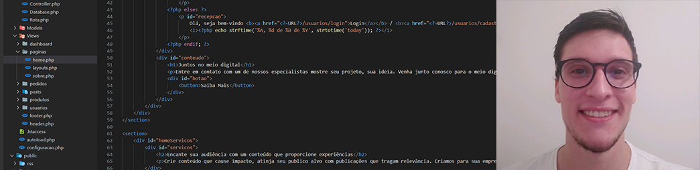

# Ola, Eu sou o Kevin 

Olá, me chamo Kevin e tenho 24 anos. Tive uma passagem que me proporcionou muito conhecimento e desenvolvimento pessoal dentro da Generation. Pude aprender diversas tecnologias como: Java, Spring, MySQL e Angula com TypeScript e podendo aplicá-las em diversos projetos pessoais firmando esses conhecimentos.

Ao longo da minha jornada sempre fui uma pessoa extremamente esforçada, me dedicando a tudo que me comprometi. Dessa forma consegui desenvolver uma habilidade de autodidata, procurando sempre estar aprendendo novas tecnologias e me desenvolvendo. 

Profissionalmente atuei durante 2 anos e meio como analista de Telecom, construindo redes de dados e telefonias. Nessa minha passagem, eu pude desenvolver minhas habilidades de atenção ao detalhe e persistência na configuração de roteadores tendo o cuidado de realizar configurações corretamente para garantir o bom funcionamento da rede.

Em 2015 iniciei meus estudos na área de tecnologia cursando Jogos Digitais, futuramente ingressei em técnico em Administração e atualmente cursando Análise e Desenvolvimento de Sistemas. Durante essa minha trajetória de estudos, eu pude adquirir muito conhecimento, dês da criação de cenários 3D, texturização, construção e composição de empresas e desenvolvimento de sistema WEB com as ferramentas HTML, CSS, JavaScript e PHP.

Tenho um proposito pessoal, poder gerar oportunidades a partir daquilo que eu gosto e seu fazer. Utilizando de meu conhecimento para poder colaborar de alguma forma com o desenvolvimento de outras pessoas. 

Sou extremamente focado em meus objetivos, batalhei e estudei muito para ter o conhecimento que tenho hoje. Acredito que conhecimento não e algo para ser guardado e sim compartilha com todos que estão a sua volta, quanto mais pessoas dominando o mesmo assunto, mais nos evoluímos como sociedade e isso e algo incrível e nisso que eu acredito.

E por isso que hoje eu estou aqui, tentando uma oportunidade para ingressar em uma grande empresa, que possa me proporcionar muito conhecimento e desenvolvimento, me aperfeiçoando e dessa forma me auxiliando a poder estar sempre colaborando com outras pessoas disseminando o conhecimento.

##### CONTATOS

    <a style="width: 33.3333%; text-align: center;" href="https://www.linkedin.com/in/kevin-alec-neri-lazzarotto-72a781137/">Linkedin</a>
    <a style="width: 33.3333%; text-align: center;" href="https://www.instagram.com/clmkevin/?hl=pt-br">Instagram</a>
    <a style="width: 33.3333%; text-align: center;" href="https://helpconnect.com.br/framework">HelpConnect</a>

## TECNOLOGIAS

    
    
    
    
    
    

